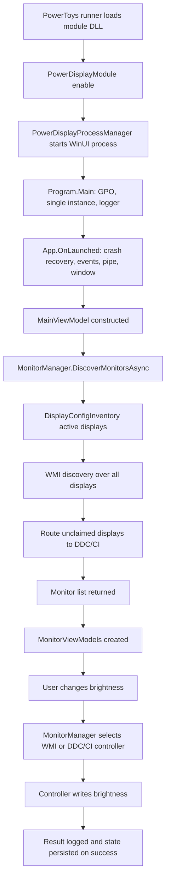

# Runtime flow

## Startup and registration

1. The PowerToys runner loads `PowerDisplayModuleInterface` as the module DLL.
2. The module checks GPO and module enable state, exposes settings/hotkey metadata, and starts `PowerToys.PowerDisplay.exe` through `PowerDisplayProcessManager` when enabled.
3. The process manager creates a generated named-pipe name, launches the executable with runner PID and pipe name, and waits for the app to connect.
4. `Program.Main` performs an early Power Display GPO disabled check, enforces single-instance behavior, initializes logging, parses runner PID/pipe name, and starts WinUI.
5. `App.OnLaunched` runs crash recovery before DDC/CI initialization, registers named events, connects to the module pipe, starts runner-exit monitoring, creates `MainWindow`, and initializes the tray icon.

## UI state initialization

`MainViewModel` is constructed by the main window. It loads profiles and UI display settings, creates a `MonitorManager`, configures the display-change watcher delay from settings, and starts asynchronous initial monitor discovery. While discovery and optional restore-on-startup run, `IsScanning` keeps interaction disabled.

## Monitor/display data loading

`MonitorManager.DiscoverMonitorsAsync` serializes discovery with a lock, asks `DisplayConfigInventory` for active displays, filters blacklisted displays, then routes:

- WMI first, across the full active inventory.
- DDC/CI second, for active displays not claimed by WMI.

The resulting monitor list is sorted by Windows display number, stored in a lookup keyed by `Monitor.Id`, and exposed to `MainViewModel`. The view model filters hidden monitors from settings and creates one `MonitorViewModel` per visible monitor.

## Brightness changes

Per-monitor slider changes update `MonitorViewModel.Brightness`, debounce commits, then call `SetBrightnessAsync`. That calls `MonitorManager.SetBrightnessAsync`, which finds the monitor by ID, selects the controller by `CommunicationMethod`, and calls that controller’s brightness write method.

Linked brightness uses `MainViewModel.LinkedBrightness` and the linked brightness planner to broadcast one value to multiple eligible brightness-capable monitors. Individual monitor backing values are updated so the UI remains coherent when linked mode changes.

## Settings/configuration flow

Settings live in the PowerToys settings infrastructure under module name `PowerDisplay`. The standalone Power Display app reads settings directly with `SettingsUtils`. Settings UI writes the same model and signals Power Display through named events. Runtime settings application updates feature visibility, hidden monitor filtering, max compatibility mode, profiles, and telemetry state.

## Failure and incomplete-data behavior

- If DisplayConfig returns no active displays, discovery logs a warning and returns an empty list.
- If WMI or DDC discovery throws at controller level, `MonitorManager.SafeDiscoverAsync` logs a warning and treats that controller as returning no monitors.
- DDC discovery logs empty monitor handles, capability fetch failures, parse failures, and max-compat probe results.
- Brightness writes return `MonitorOperationResult`; view models log warning/error text but do not throw UI exceptions.
- DDC capability probing is guarded by crash detection/recovery that can disable/lock the feature on later startup.

## Diagram

