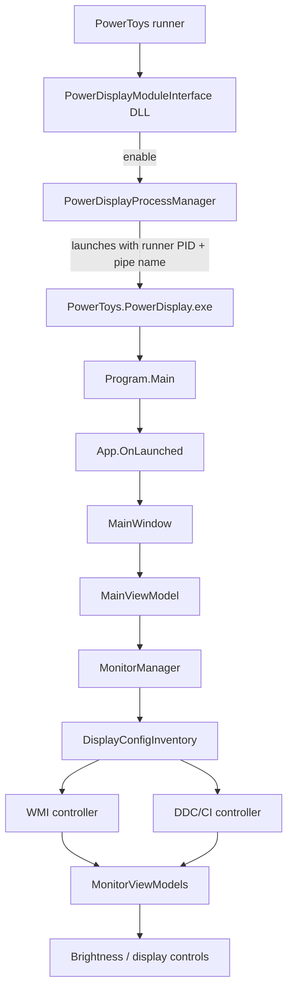
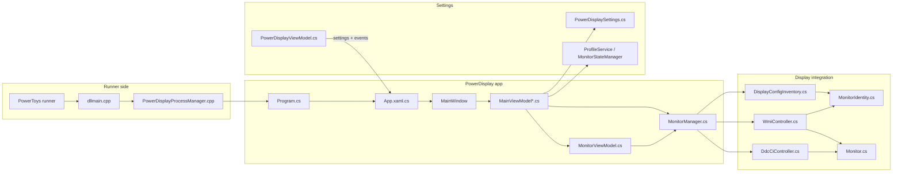
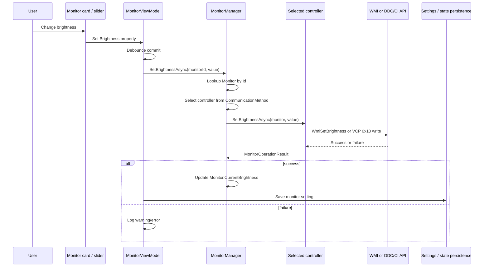
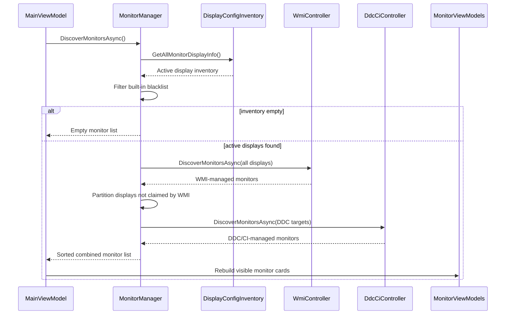
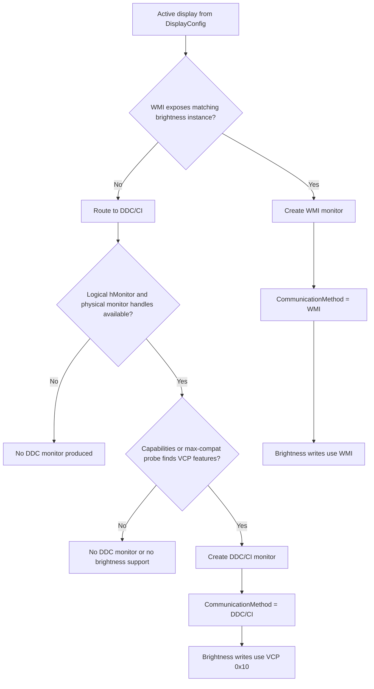

# Power Display diagrams

## 1. Runtime flow

## 2. Module and file interaction

## 3. Sequence: changing monitor brightness

## 4. Sequence: monitor discovery

## 5. Controller routing overview

