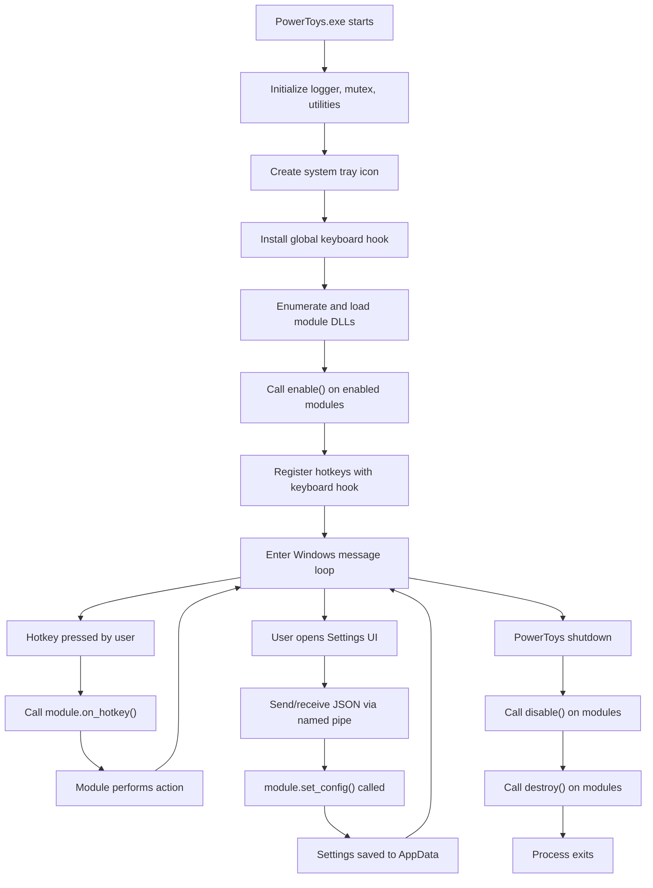

# Runtime Flow

## Application Startup Sequence

PowerToys startup begins when the user launches `PowerToys.exe` (or it auto-starts via Windows Registry entry). The process follows this high-level flow:

```
PowerToys.exe starts
  ↓
[Logger initialized]
  ↓
[Single-instance mutex created] (prevents multiple instances)
  ↓
[Common utilities initialized]
  ↓
[Command-line arguments parsed]
  ↓
[System tray icon created and registered with OS]
  ↓
[Low-level keyboard hook installed] (global hotkey capture)
  ↓
[Module DLLs enumerated and loaded]
  ↓
[Enabled modules' enable() method called]
  ↓
[Registered hotkeys from enabled modules added to global hook]
  ↓
[Windows message loop entered] ← Stays here until shutdown
```

### Key Startup Files

- **Entry point**: `src/runner/main.cpp` – Contains `render_main()` function with orchestration logic
- **Tray icon setup**: `src/runner/tray_icon.cpp` – Registers window class and system tray icon
- **Module loading**: `src/runner/powertoy_module.cpp` – Loads DLLs, calls `powertoy_create()` export
- **Hotkey registration**: `src/runner/centralized_kb_hook.cpp` – Installs low-level keyboard hook

---

## Hotkey Press and Dispatch

When a user presses a registered hotkey globally, the flow is:

```
Hotkey pressed
  ↓
[Windows OS calls low-level keyboard hook] (set by SetWindowsHookEx)
  ↓
[Hook callback in centralized_kb_hook.cpp triggered]
  ↓
[Hotkey matched against registered hotkeys]
  ↓
[Module's on_hotkey() method called with hotkey ID]
  ↓
[Module performs action or launches external application]
```

This path is performance-critical: it runs in the global keyboard hook, so any delay here affects system responsiveness. Modules typically avoid heavy processing here and instead use it as a signal to launch a worker thread or external process.

---

## Settings UI Interaction

The Settings UI is a separate process (`SettingsUI.exe` or hosted as WinUI 3 app). When a user opens it, communication flows through named pipes:

```
User clicks tray icon
  ↓
[Tray icon window receives WM_RBUTTONUP message]
  ↓
[Menu shown; user selects "Settings"]
  ↓
[Runner's tray_icon_window_proc() sends JSON message over named pipe]
  ↓
[Settings UI process receives message on pipe]
  ↓
[Settings UI main window shown/brought to foreground]
  ↓
[User changes a module setting]
  ↓
[Settings UI sends new config JSON over pipe to Runner]
  ↓
[Runner passes JSON to target module's set_config() method]
  ↓
[Module updates its internal state (may require disable/enable cycle)]
  ↓
[Settings persisted to AppData\Local\Microsoft\PowerToys\settings.json]
```

### IPC Pipe Structure

- **Server side** (Runner): Listens on named pipe for Settings UI connections
- **Client side** (Settings UI): Connects to named pipe and maintains persistent connection
- **Message format**: JSON strings, parsed by both sides
- **Common message types**:
  - `{"ShowYourself":"Dashboard"}` – Open main settings window
  - `{"ShowYourself":"flyout"}` – Show quick access flyout
  - Module-specific settings updates

---

## Module Initialization and Configuration

When a module is loaded and enabled, the flow is:

```
Module DLL loaded
  ↓
[Runner calls exported powertoy_create() function]
  ↓
[Module object instantiated]
  ↓
[Runner calls get_key() to get module ID]
  ↓
[Runner calls get_config() to read current settings]
  ↓
[If settings indicate enabled, Runner calls enable()]
  ↓
[enable() performs setup: registers hotkeys, starts timers, etc.]
  ↓
[Runner calls get_hotkeys() to get registered hotkeys]
  ↓
[Hotkeys added to global keyboard hook]
  ↓
[Module ready to receive on_hotkey() callbacks]
```

The Runner may call `get_config()` multiple times: once on startup, and again whenever the user opens Settings to refresh the current state for UI display.

---

## Settings Persistence

Settings are stored in a JSON file at:
```
%LocalAppData%\Microsoft\PowerToys\settings.json
```

Reading/writing is handled by `src/common/SettingsAPI/settings_helpers.h`. The flow is:

```
Module or Runner needs to read/write settings
  ↓
[SettingsAPI helpers construct path]
  ↓
[If reading: JSON file parsed into in-memory structure]
  ↓
[If writing: in-memory structure serialized to JSON and written to disk]
  ↓
[File written atomically to prevent corruption]
```

This ensures settings survive application restarts and are available to all modules.

---

## Shutdown Sequence

When PowerToys exits (either user quits or OS shuts down):

```
PowerToys shutdown initiated
  ↓
[Windows message loop exits or WM_QUIT received]
  ↓
[For each loaded module: disable() called]
  ↓
[Low-level keyboard hook removed]
  ↓
[Tray icon unregistered]
  ↓
[For each module: destroy() called (frees memory)]
  ↓
[Module DLLs unloaded]
  ↓
[Logger closed]
  ↓
[Process exits]
```

---

## Mode Differences

### Dev/Debug Mode

- Additional logging may be enabled
- Debugger can attach to PowerToys.exe
- Settings may be cleared on rebuild (not persisted)
- Modules loaded from build output directory

### Release Mode

- Minimal logging (only errors/critical info)
- Settings persisted and reused across runs
- Modules loaded from installation directory
- Code optimized for performance and binary size

### Test Mode

- Test harness can instantiate modules directly
- Settings file can be mocked or isolated to temp directory
- Hotkey registration may be skipped in unit tests

---

## Runtime Flow Diagram



---

## Performance Considerations

**Hot path** (executed on every hotkey press):
- Keyboard hook callback
- Hotkey matching
- `on_hotkey()` call

Modules must complete these quickly (< 10 ms recommended) to avoid perceived system lag.

Heavy processing should be offloaded to worker threads or external processes (launched by the module).

**Cold path** (executed less frequently):
- Module loading/unloading
- Settings UI interaction
- IPC communication with Settings

These can afford to be slower since they don't block the hotkey dispatch loop.

---

## Key Entry Points Summary

| Action | Triggered By | Handler Location | Primary Functions |
|--------|--------------|-------------------|------------------|
| Application startup | OS / user | `src/runner/main.cpp:render_main()` | Module loading, tray creation |
| Hotkey press | User keyboard input | `src/runner/centralized_kb_hook.cpp` | Hook callback, module dispatch |
| Settings UI interaction | User click on tray | `src/runner/tray_icon.cpp:tray_icon_window_proc()` | UI launch via IPC |
| Settings change | User in Settings UI | `src/common/interop/two_way_pipe_message_ipc.h` | JSON message delivery |
| Module configuration | Settings change or startup | Module's `set_config()` and `enable()` | Module state update |
| Application shutdown | User quit or OS | `src/runner/main.cpp` | Cleanup and IPC closure |
