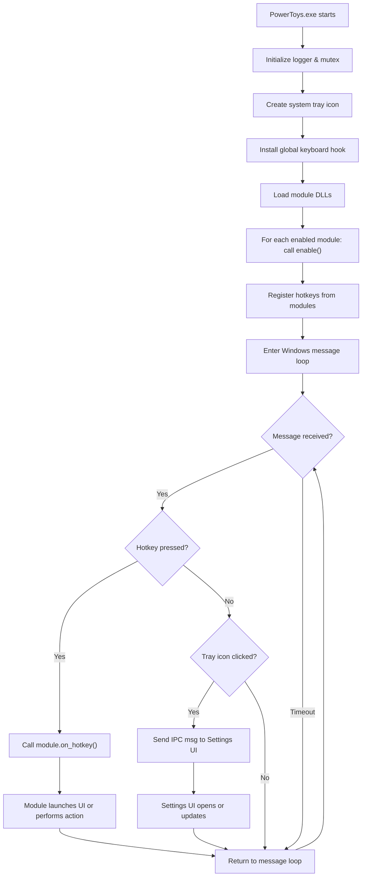
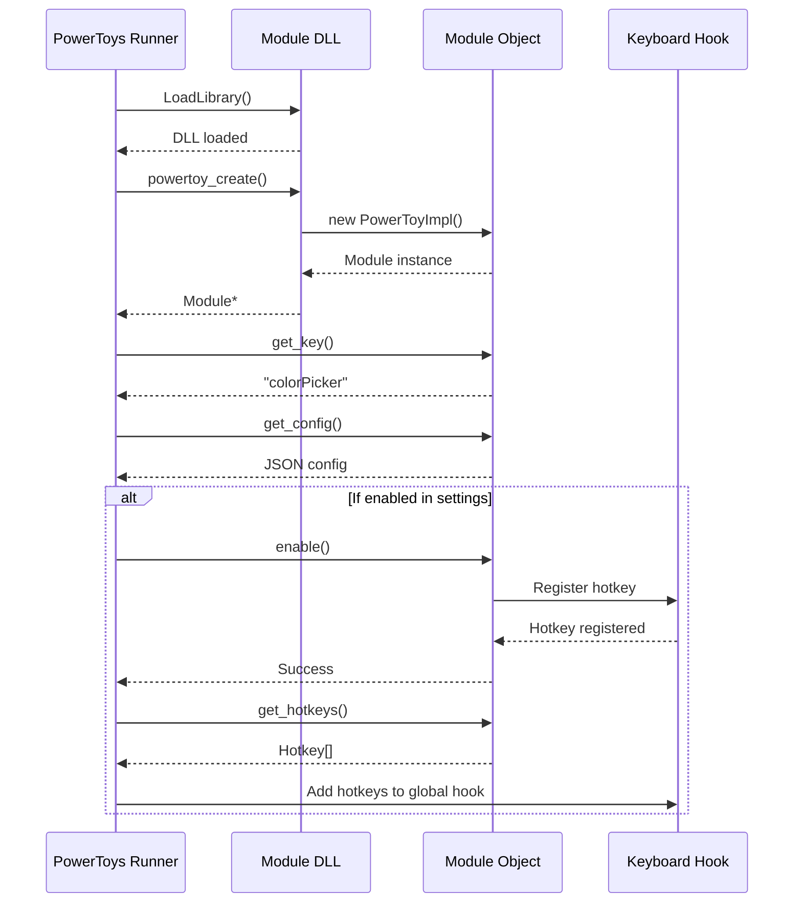
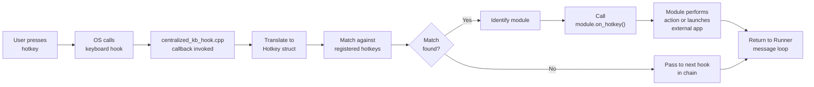
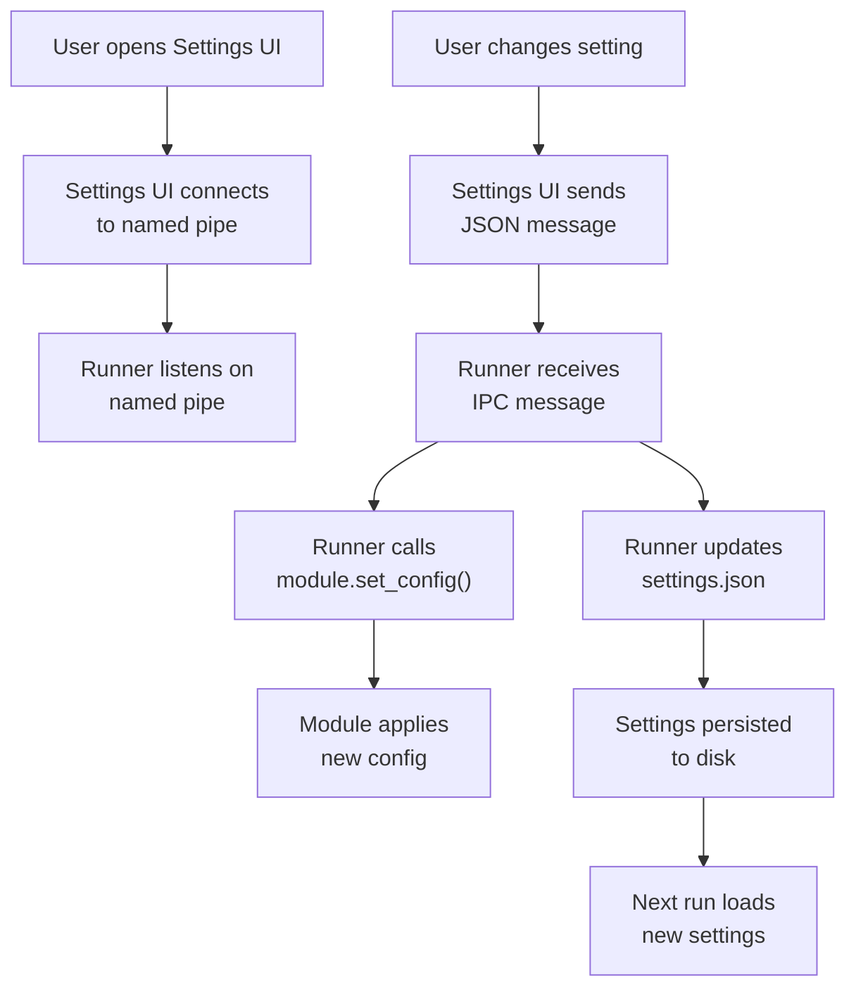
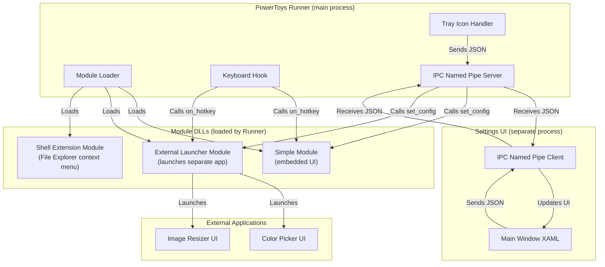
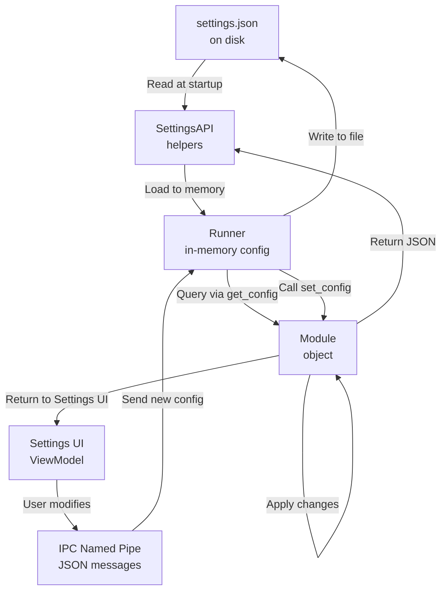
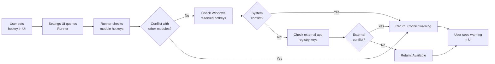
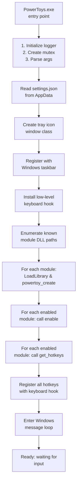
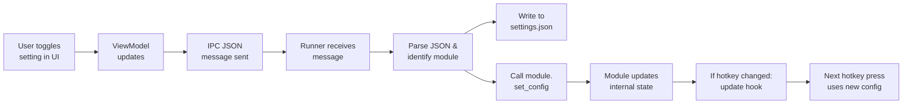
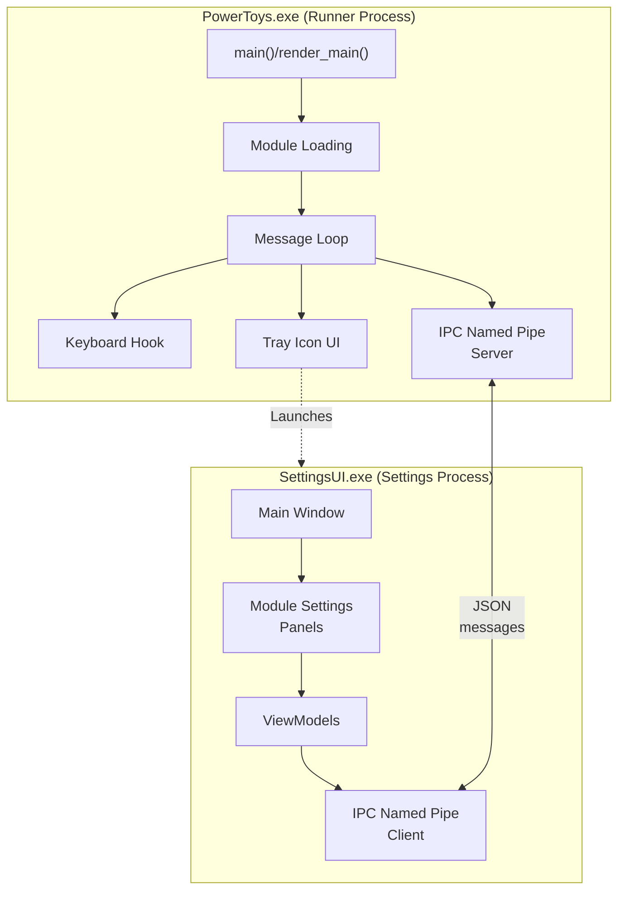

# Diagrams

## 1. Runtime Flow Diagram

Execution flow from startup to hotkey dispatch:

---

## 2. Module Loading and Initialization

Detailed sequence of module DLL loading and enablement:

---

## 3. Hotkey Press and Dispatch

Low-level flow when user presses a hotkey:

---

## 4. Settings UI and IPC Communication

Data flow between Settings UI and Runner:

---

## 5. Module Architecture and Component Interaction

High-level view of module types and how they fit together:

---

## 6. Settings Persistence and Module Configuration

Configuration data flow and storage:

---

## 7. Hotkey Conflict Detection

How PowerToys detects and handles hotkey conflicts:

---

## 8. Startup Sequence (Detailed)

Complete startup sequence with timing and dependencies:

---

## 9. Settings Change Propagation

How a setting change flows through the system:

---

## 10. Process Architecture

Two main processes and their communication:

---

## Summary

These diagrams illustrate:

1. **Runtime flow** – Startup through message loop
2. **Module loading** – DLL instantiation and initialization sequence
3. **Hotkey dispatch** – How keyboard input reaches modules
4. **Settings communication** – IPC between Runner and Settings UI
5. **Module architecture** – Different module types and their relationships
6. **Configuration storage** – Settings file, in-memory state, and module binding
7. **Conflict detection** – Hotkey validation before assignment
8. **Detailed startup** – Step-by-step initialization with dependencies
9. **Setting propagation** – How config changes flow through the system
10. **Process architecture** – Two main processes and their IPC channel

Each diagram emphasizes the key components and how they interact to achieve PowerToys' functionality.
